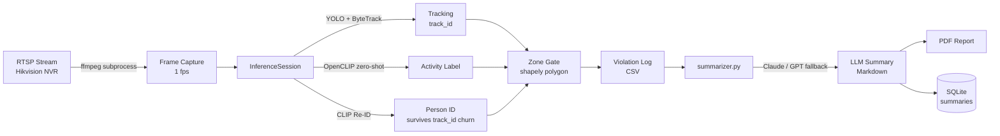

# AI System for CCTV Compliance

Real-time CCTV-based workplace compliance monitoring system - processes a live RTSP stream directly (no full video recording), detects employee activity and violation, then automatically generate a daily operational summary via LLM.

## Pipeline Architecture



## Tech Stack

- **Capture**: ffmpeg (subprocess), watchdog (new frame detection)
- **Object Detection & Tracking**: YOLO, ByteTrack
- **Activity Classification**: OpenCLIP (zero shot)
- **Re-Identification**: CLIP embedding cosine similarity (inprocess, numpy) - survive `track_id` churn for up to 90 frames
- **Scheduling**: APScheduler (CronTrigger)
- **Automated Summary**: Claude (primary), GPT (fallback)
- **Storage**: SQLite (session summaries), CSV files per session (raw logs)

## Hardware 

- NVR: Hikvision NVR AcuSense
- camera: Hikvision DS-2CD1143G2-LIU

## Setup

### 1. Environment Variables

```env
RTSP_USERNAME=
RTSP_PASSWORD=
RTSP_IP=
RTSP_PORT=
TIMEZONE=Asia/Jakarta
 
ANTHROPIC_API_KEY=
ANTHROPIC_MODEL=
OPENAI_API_KEY=
OPENAI_MODEL=
```

### 2. Database

Schema is stored under `pipeline/db/migrations`. Apply the migration to your SQLite file:

```bash
sqlite3 path/to/your.db < pipeline/db/migrations/000001_init.up.sql
```

To roll back (drop all tables):

```bash
sqlite3 path/to/your.db < pipeline/db/migrations/000001_init.down.sql
```

Add the database config to `config.py`:

```python
DB_PATH = "path/to/your.db"
```

### 3. Install Dependencies

```bash
pip install -r requirement.txt
```

## Database Schema

**`summaries`** — one row per capture session
 
| Column | Type | Description |
|---|---|---|
| `id` | INTEGER | Primary key, auto increment |
| `video_name` | TEXT | Capture session identifier |
| `session_start` | TEXT | Capture start time (ISO8601) |
| `ops_score` | INTEGER | Overall Operations Score (0–100) |
| `active_pct` | REAL | Active working time percentage |
| `idle_pct` | REAL | Idle time percentage |
| `violations_pct` | REAL | Violation time percentage |
| `zone_in_pct` | REAL | Time inside work zone percentage |
| `zone_out_pct` | REAL | Time outside work zone percentage |
| `summary_text` | TEXT | LLM-generated summary content (markdown) |
| `pdf_path` | TEXT | Path to the rendered PDF report |

## Usage

Run a capture for a given duration:

```bash
python -m recorder.stream_capture --duration 300 --label productivity
```

Options:
- `--duration` -> capture duration in seconds
- `--label` -> session label, included in the file/video name
- `--start-time` -> manual capture start time (`HH:MM` or `HH:MM:SS` format), used as the timestamp basis in the log

Output: a per-session CSV log (`output/violation_log_*.csv`), a summary PDF (`output/summaries/*.pdf`), and a new row in the `summaries` table.

## Roadmap
 
- [ ] Face recognition (InsightFace: SCRFD + ArcFace) for employee_id identification, bound to `person_id`, behind a `FACE_ID_ENABLED` flag
- [ ] Phase 0: camera-angle feasibility spike before full implementation
- [ ] Explore a YOLOv11 upgrade for small/occluded objects
- [ ] Attribute-based detection (clothing color, hair) as a fallback identification method when clients don't want to register employee faces